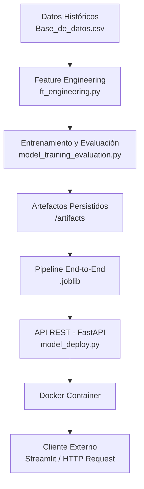

# Proyecto Integrador - Módulo 5
## MLOps:Despliegue de Modelo de Riesgo Crediticio
### Bootcamp Data Science – SoyHenry

**Autora:** Sofia Schanton

#### Contexto del Proyecto

Este proyecto se desarrolla en el marco del Proyecto Integrador del modulo 5, donde el rol asignado es Científico de Datos Junior Advanced dentro del equipo de Datos y Analítica de una empresa financiera.

El objetivo principal es desarrollar un modelo predictivo de riesgo crediticio, utilizando información histórica de créditos para anticipar el comportamiento de nuevos usuarios y estimar la probabilidad de pago a tiempo.

### Objetivos del Proyecto
✔ Documentar y versionar correctamente el proyecto en GitHub
✔ Implementar scripts para despliegue del modelo
✔ Automatizar tareas del pipeline y monitoreo
✔ Entrenar modelos supervisados
✔ Evaluar rendimiento con métricas apropiadas
✔ Integrar principios de MLOps
✔ Desarrollar aplicación en Streamlit
✔ Disponibilizar el modelo mediante API
✔ Dockerizar la solución

### Estructura del Repositorio
El repositorio respeta la estructura indicada:

mlops_pipeline/
│
├── src/
│   ├── cargar_datos.ipynb
│   ├── cargar_datos.py
│   ├── comprension_eda.ipynb
│   ├── ft_engineering.py
│   ├── model_training_evaluation.py
│   ├── model_monitoring.py
│   ├── model_deploy.py
│
├── Base_de_datos.csv
├── Dockerfile
├── Licence
├── requirements.txt
├── .gitignore
└── README.md

Las ramas utilizadas son:
-  master
- certification
- developer

El flujo de trabajo se realizó siguiendo versionado semántico (V1.0.0, V1.0.1, V1.1.0, etc.).

##### Exploración y Comprensión de Datos

##### cargar_datos.ipynb y cargar_datos.py

Se desarrolló un notebook para la carga inicial del dataset desde un archivo Excel mediante ruta absoluta.
Posteriormente se generó un archivo .py reutilizable para integrar la carga al pipeline productivo.

##### Exploratory Data Analysis (comprension_eda.ipynb)

Notebook dedicado a la exploración y comprensión del dataset previo al modelado.

Análisis realizados:

- Análisis univariable: distribución, outliers, asimetrías.

- Análisis bivariable: relación entre variables y el target.

- Análisis multivariable: patrones conjuntos y segmentación.

- Matriz de correlación.

Hallazgos principales

Fuerte desbalance de clases: pago_a_tiempo = 1 es ampliamente mayoritario, mientras que 0 es minoritario.

Implicancias:

- Las comparaciones deben interpretarse con cautela.

- El grupo minoritario puede magnificar outliers.

- Es necesario utilizar métricas robustas y técnicas para datos desbalanceados.

- El target está fuertemente explicado por puntaje (correlación ≈ 0.92)

- Las variables monetarias: Presentan asimetría y outliers, requieren tratamiento robusto (capping / escalado robusto).

- Las variables categóricas aportan segmentación moderada, especialmente tendencia_ingresos.

Implicancias para el modelado

- Aplicar transformaciones robustas.

- Controlar el desbalance (estratificación, métricas adecuadas, threshold tuning).

- Tratar outliers.

- Evaluar impacto de variables altamente correlacionadas.

#### Feature Engineering (ft_engineering.py)

Módulo central que encapsula el preprocesamiento evitando data leakage.

Se encarga de:

- Cargar datos (cargar_datos) y renombra columnas a snake_case.

- Filtrar datos futuros por cutoff_date en fecha_prestamo para entrenar solo con histórico.

- Separar X / y (pago_atiempo por defecto).

- Split temporal (por fecha, sin mezclar pasado/futuro) o random (con random_state y stratify opcional).

- Aplicar Feature Engineering:

  - descomponer fecha_prestamo (año/mes/día/dow/quarter) y elimina la fecha original

  - limpiar outliers/imposibles (edad_cliente, puntajes negativos)

  - normalizar strings y corrige valores numéricos mal cargados en categóricas

  - agrupar categorías raras en tipo_credito

- Tratar outliers numéricos con capping por cuantiles (aprendido en train).

- Preprocesamiento por tipo de variable:

  - numéricas: imputación mediana + RobustScaler

  - ordinal: tendencia_ingresos con orden definido

  - categóricas: imputación + OneHotEncoder

Funciones principales:

- build_data_pipeline(...): arma Pipeline( FE → Capper → Preprocessor )

- split_data(...): split temporal o random

- ft_pipeline(...): ejecuta el flujo end-to-end y devuelve:

- X_train_p, X_test_p (DataFrames preprocesados con nombres de features)

- y_train, y_test

- artifacts (pipeline, feature_names, config del split, balance de clases, cutoff)

#### Entrenamiento y Evaluación (model_training_evaluation.py)

Script completo de entrenamiento, validación, selección y persistencia.

Modelos evaluados: Logistic Regression (class_weight="balanced"), Random Forest, XGBoost, LightGBM y CatBoost

Validación: TimeSeriesSplit (5 folds) y métricas orientadas a desbalance: ROC-AUC, PR-AUC, Balanced Accuracy, F1, PR-AUC clase 0.

Selección del modelo: criterio robusto: cv_pr_auc_0_mean - cv_pr_auc_0_std

Mejor modelo:✅ Logistic Regression

Se optimiza el threshold maximizando F1 clase 0 mediante predicciones OOF.

Threshold óptimo: 0.5351, F1 clase 0 (train): 0.1404

Resultados en Test

Confusion Matrix:

[[  27   32]
 [ 656 1386]]

Se prioriza un modelo lineal regularizado debido a su alta trazabilidad, interpretabilidad y alineación con requerimientos regulatorios propios del sector financiero. Asimismo, este tipo de modelo ofrece mayor estabilidad ante posibles escenarios de drift moderado en comparación con alternativas más complejas.

Los resultados obtenidos reflejan la dificultad inherente de modelar la clase minoritaria en un contexto de fuerte desbalance estructural. Esto pone de manifiesto la necesidad de incorporar técnicas avanzadas de tratamiento del desbalance —como reweighting, resampling o estrategias de optimización específicas por clase— con el objetivo de mejorar la capacidad de detección de eventos poco frecuentes sin comprometer la estabilidad global del modelo.

#### Data Drift Monitoring Dashboard (model_monitoring.py)

Se desarrolló un dashboard interactivo en Streamlit para monitorear data drift del modelo de clasificación, comparando un conjunto de referencia (histórico) contra uno nuevo (reciente) mediante un split temporal sobre fecha_prestamo. El objetivo es detectar cambios en la distribución de las variables que puedan degradar el comportamiento del modelo en producción.

El monitoreo se realiza en dos niveles:

- RAW (datos crudos): drift sobre las variables originales del dataset (excluyendo fecha_prestamo).

- PRE (datos preprocesados): drift sobre el espacio real del modelo, aplicando el ft_pipeline.joblib (Feature Engineering + preprocesamiento) guardado en artifacts/, lo cual permite detectar drift incluso cuando en RAW parece estable pero el modelo “ve” transformaciones distintas.

Métricas y tests aplicados por tipo de variable:

- Numéricas:

  - KS test (p-value < α) para detectar diferencias estadísticas de distribución

  - PSI (Population Stability Index) como medida de magnitud del drift

  - JSD (Jensen–Shannon Distance) como distancia entre distribuciones

  - Además se reportan mean/median y sus deltas entre referencia y nuevo

- Categóricas / ordinales:

  - Chi-square test (p-value < α)

  - PSI categórico y JSD categórico

  - Se reporta categoría top (moda), proporción y delta entre períodos

- Sistema de alertas (“semáforo”)

🔴 Drift crítico: presencia de PSI/JSD crítico en varias variables

🟠 Drift moderado: drift estadístico relevante o múltiples warnings

🟡 cambios leves: drift estadístico sin magnitud relevante

🟢 estable: sin alertas relevantes

Visualizaciones incluidas

- Heatmap Top 10 de intensidad de drift (PSI/KS/JSD escaladas a 0–1)

- Comparación de distribuciones (histogramas para numéricas / barras para categóricas)

- Tendencia temporal del drift por ventanas (W/M/Y) para las variables más afectadas

Salida / uso práctico

- Permite priorizar variables con mayor drift (Top 10) y decidir acciones:

- continuar monitoreo, revisar pipeline/fuente de datos, o considerar reentrenamiento si el drift persiste, especialmente en PRE, que es el espacio que impacta directamente al modelo.

(Nota: el dashboard incluye además una pestaña “Predicción” para consumir la API /predict por batch, pero el foco principal del script es el monitoreo de DATA DRIFT, no performance del modelo.)

#### FastAPI Model Deployment (model_deploy.py )

Se implementó una API REST con FastAPI para disponibilizar el modelo entrenado y permitir predicciones por lote (batch) a partir de datos crudos (RAW). La API carga un pipeline end-to-end guardado en artifacts/ que incluye preprocesamiento + modelo, por lo que recibe registros con el mismo esquema del dataset original y devuelve la predicción final.

Características principales

- Carga del modelo end-to-end desde:
artifacts/models/logistic_regression_end_to_end_pipeline.joblib
(generado previamente por model_training_evaluation.py).

- Threshold configurable (THRESHOLD = 0.53) para transformar probabilidades en clase final.

- Validación de entrada con Pydantic mediante schemas:

  - PredictionInput (un registro)

  - PredictionBatch (lista de registros)

- Endpoints

  - GET /saludo: verifica que la API está funcionando y responde un mensaje simple.

  - POST /predict: recibe un JSON con la clave records (lista de registros), convierte a DataFrame, transforma fecha_prestamo a datetime y devuelve:

    - pred: clase final (0/1)

    - proba_pago_atiempo: probabilidad de clase 1 (si el modelo soporta predict_proba)

    - n_records: cantidad de registros procesados

Ejecución

- Se levanta con Uvicorn en 0.0.0.0:5040: uvicorn model_deploy:app --reload --host 0.0.0.0 --port 5040

#### Dockerfile (Containerización de la API)

Se creó un Dockerfile que:

- Usa python:3.10-slim

- Instala dependencias

- Copia código fuente

- Expone puerto 8000

- Ejecuta Uvicorn

- Permite reproducibilidad completa del entorno.

**Cómo construir y ejecutar la imagen Docker**

1) Construir la imagen

Desde la carpeta raíz del proyecto (donde se encuentra el Dockerfile), ejecutar:

docker build -t mlops-pago-api .

Este comando construye una imagen Docker que contiene el código fuente, las dependencias y la configuración necesaria para ejecutar la API del modelo.

2) Ejecutar el contenedor

Una vez construida la imagen, ejecutar:

docker run -d --name mlops-pago-deploy -p 5050:8000 mlops-pago-api

Donde:

-d ejecuta el contenedor en segundo plano.

--name asigna un nombre al contenedor.

-p 5050:8000 mapea el puerto 8000 del contenedor al puerto 5050 de la máquina local.

mlops-pago-api es el nombre de la imagen creada previamente.

3) Verificar que el contenedor esté corriendo
docker ps

4)  Acceder a la API

Una vez iniciado el contenedor, la API estará disponible en:

http://localhost:5050

Como se utiliza FastAPI, la documentación interactiva puede consultarse en:

http://localhost:5050/docs

#### Arquitectura del sistema

#### Enfoque MLOps aplicado

El proyecto incorpora prácticas fundamentales de MLOps orientadas a reproducibilidad, trazabilidad y despliegue en entorno productivo.

**Pipeline reproducible:**

Se implementó un pipeline modular en ft_engineering.py que integra:

- Feature Engineering: Tratamiento de outliers (capping por cuantiles aprendidos en train)

- Preprocesamiento por tipo de variable: El pipeline se ajusta únicamente sobre el conjunto de entrenamiento y luego se reutiliza para transformación en test y producción, evitando data leakage y garantizando consistencia entre entornos.

**Separación entrenamiento / inferencia**

Se diferenciaron claramente los componentes:

- model_training_evaluation.py: entrenamiento, validación, selección y guardado del modelo.

- model_deploy.py: carga del modelo ya entrenado y expone un endpoint de predicción.

El modelo productivo utiliza un pipeline end-to-end (RAW → predicción) previamente persistido, lo que asegura que las transformaciones aplicadas en producción sean idénticas a las utilizadas en entrenamiento.

**Persistencia de artefactos**

Se guardan de forma estructurada en /artifacts/:

- ft_pipeline.joblib (feature engineering + preprocessing)

- Modelo entrenado (<model>.joblib)

- Pipeline completo (<model>_end_to_end_pipeline.joblib)

- Esto permite reutilización, versionado y desacoplamiento entre entrenamiento y despliegue.

**Metadata de corrida**

Cada entrenamiento genera un archivo JSON con:

- Target utilizado

- Columnas excluidas

- Configuración del split

- Threshold óptimo

- Métricas de validación y test

- Información de tuning (si aplica)

- Esto mejora la trazabilidad y facilita auditoría o comparación entre experimentos.

**Monitoreo de Data Drift**

Se desarrolló un dashboard en Streamlit que evalúa drift en datos RAW y espacio PRE (post-transformación del modelo).

- Se aplican métricas estadísticas (KS, Chi-square) y métricas de magnitud (PSI, JSD), con sistema de alertas configurable.

- Esto permite detectar desviaciones en la distribución de variables que podrían afectar la estabilidad del modelo en producción.

**API productiva**

Se implementó una API REST con FastAPI que:

- Carga el modelo entrenado

- Recibe datos por batch (JSON/CSV)

- Devuelve predicción y probabilidad

- Permite configurar threshold

- Esto facilita integración con sistemas externos.

**Dockerización**

Se creó un Dockerfile que incluye:

- Código fuente

- Dependencias (requirements.txt)

- Servidor Uvicorn

- Esto permite empaquetar la solución en una imagen portable, asegurando reproducibilidad del entorno de ejecución.